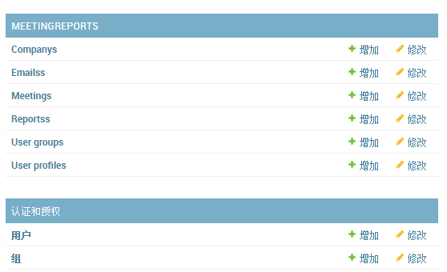

# MeetingReport
每天早会记录邮件发送例子，仅供学习测试Python+Django，可能有不合理之处，如有疑惑请查阅相关技术文档。

## 特点
* 支持注册、登录（支持用户名、邮箱登录，参见 `EmailBackend.py`）
* 自定义Tag和Filter（`MeetingReports/templatetags/custom_extras.py`）
* 发送邮件+邮件详情+邮件历史
* 邮件支持HTML模板，并带文字+图片签名
* 收件人+抄送人列表，数据库持久化
* 记录人可排序，循环交替发送邮件，支持请假，每天只能一人发送报告，且只能发送一次
* 支持里程碑，支持自动填写上次早会内容，早会条目支持自增编号
* 个人信息及公司信息数据库持久化

## Models


## 使用
* 完善个人邮箱设置（`MeetingReports_Project/settings.py`）：
```
# Send Email
EMAIL_BACKEND = 'django.core.mail.backends.smtp.EmailBackend'
EMAIL_HOST = 'smtp.emailhost.com'
EMAIL_HOST_USER = 'youremail@emailhost.com'
EMAIL_PORT = 465
EMAIL_HOST_PASSWORD = ''
EMAIL_USE_SSL = True
```
* 登录后台，超级用户：`wr`，密码：`zaq1xsw2`（其他用户密码相同）
* 访问`/admin/MeetingReports/emails/`，更新收件人、抄送列表数据
* 直接访问首页

## 截图
